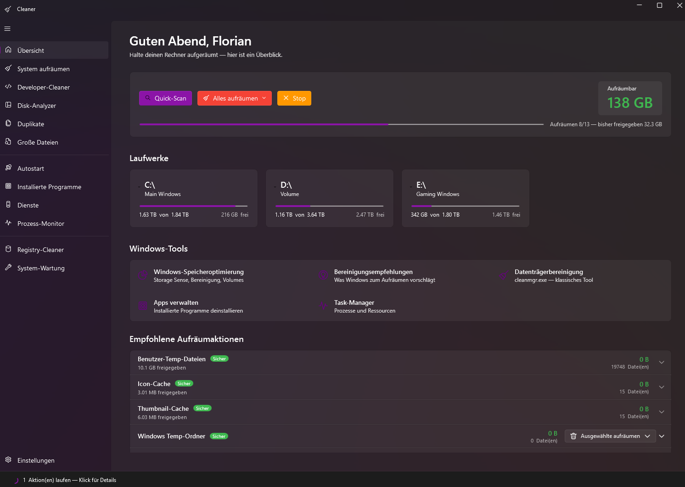

# PowerClean

A modern Windows 11 WPF app that combines the best of **CCleaner** (safe cleanup) and **WinDirStat** (visual disk analysis) — with extras like a registry cleaner, autostart manager, services and process monitor, and system maintenance one-clicks.

[](https://github.com/fgilde/PowerClean/releases/latest)
[](https://github.com/fgilde/PowerClean/actions/workflows/release.yml)
[](LICENSE)



## Features

### Safe cleanup (CCleaner-style)
4-level safety classification (**Safe · Recommended · Caution · Warning**). Recycle Bin is default — every action is reversible unless you opt-in to permanent delete. Each cleanup entry is **expandable** so you can see every file path it will touch before you click clean.

- Windows temp folders (user & system)
- Thumbnail & icon caches
- Windows update cache (`SoftwareDistribution\Download`)
- Delivery-Optimization cache (P2P update cache)
- Logs, prefetch, memory dumps
- Recycle Bin (via Shell API)
- **Browser caches**: Chrome, Edge, Brave, Firefox — only cache folders, never bookmarks/cookies/history

### Developer cleaner (for the `%LOCALAPPDATA%\JetBrains`-bloat crowd)
- **JetBrains IDEs** (Rider, IntelliJ, PyCharm, WebStorm, GoLand, PhpStorm, CLion, DataGrip): caches, logs, indexes & local history — config preserved
- **Visual Studio**: ComponentModelCache, ServiceHub logs
- **NuGet**: HTTP cache and aged global packages
- **npm / pnpm / yarn** caches
- **`bin/obj`** folders in your `.NET` projects (only in real project trees)
- **`node_modules`** folders in your workspaces
- **Docker**: `docker system prune` (never `--volumes`, so no data loss)

### Disk analyzer (WinDirStat-style)
- Squarified treemap as a custom WPF control — proportional rectangles per file/folder
- **Live update** during scan — see results growing as the scan runs
- Parallel scan engine (multi-core, skips junctions/symlinks)
- Drill-down via tile **double-click** or tree-view
- Right-click context menu on every tile and tree node: Open in Explorer, Open with default app, Open in terminal, Copy path, Windows properties dialog, Delete

### Autostart manager (more than Task Manager)
All Windows autostart sources in one place:
- HKLM/HKCU `\Run` and `\RunOnce` (+ Wow6432Node variants)
- User and Common startup folders
- Scheduled Tasks with logon/boot triggers (Microsoft tasks filtered out)
- Auto-start services
- Enable/disable via the same `StartupApproved` registry mechanism Windows uses

### Installed programs
- Reads from registry (HKLM + HKCU + Wow6432Node)
- Size, version, publisher, install date
- Sort by size to find space hogs, by date to find old leftovers
- Direct uninstall (uses `QuietUninstallString` if available)
- Right-click: open install folder (with multi-source fallback), search web, jump to registry key

### Services & recommendations
- All Windows services with RAM usage (WMI-resolved)
- Heuristic recommendations for typically deactivatable services (Fax, RemoteRegistry, DiagTrack, MapsBroker, WSearch, Print Spooler if no printer, Xbox, WerSvc, TabletInputService)
- Start / Stop / Set startup type (Auto / Manual / Disabled) — requires admin
- Direct jump to `services.msc`

### Process monitor
- Top processes by RAM / CPU / threads / handles
- Updates every 2 seconds (toggleable)
- Per-process: open file location, properties, search web, kill process

### Registry cleaner
- 7 categories scanned in parallel:
  - App Paths pointing to deleted exes
  - Dead autostart entries
  - Dead uninstaller entries
  - Obsolete MUI cache
  - OpenWith entries for deleted apps
  - SharedDLL references
  - File-extension ProgIDs that don't exist
- Every clean operation creates a **`.reg` backup** in `%LOCALAPPDATA%\PowerClean\RegistryBackups\` — restore by double-click

### System maintenance (one-click)
- Hibernation toggle (often saves several GB)
- Pagefile info + jump to Windows settings
- Restore points: list, delete oldest, delete all
- **DISM component cleanup** (often 5–10 GB)
- DISM /ResetBase (permanent, irreversible)
- DNS cache flush
- Print queue clear
- Recycle Bin force-empty

### Other
- **Background task overview**: status strip at the bottom shows running scans/cleans; click for a popup with progress and cancel button
- **Split-button** for cleanup actions: explicit choice between recycle bin and permanent delete every time
- **Localization**: German and English, with live switch in Settings (defaults to your Windows UI language)
- **Native Win11 look**: WPF-UI Fluent design, Mica backdrop, your Windows accent color picked up from the registry
- **Auto-update**: checks GitHub releases on startup, prompts to install (via Velopack)

## Tech stack

| Area              | Technology                                       |
|-------------------|--------------------------------------------------|
| Framework         | .NET 9 (`net9.0-windows10.0.19041.0`) + WPF      |
| UI library        | [WPF-UI](https://wpfui.lepo.co) (Fluent / Mica)  |
| MVVM              | CommunityToolkit.Mvvm                            |
| DI / Hosting      | Microsoft.Extensions.Hosting                     |
| Installer/updater | [Velopack](https://github.com/velopack/velopack) |
| Architecture      | `Cleaner.Core` (logic) + `Cleaner.App` (UI)      |

## Install

Grab the latest installer from [Releases](https://github.com/fgilde/PowerClean/releases/latest):

```
PowerClean-Setup.exe
```

Double-click to install. The app installs to `%LOCALAPPDATA%\PowerClean` (no admin needed) and self-updates from GitHub on subsequent runs.

## Build from source

Prerequisite: **.NET 9 SDK**.

```powershell
git clone https://github.com/fgilde/PowerClean.git
cd PowerClean
dotnet build
dotnet run --project src/Cleaner.App
```

The output binary is `PowerClean.exe` under `src/Cleaner.App/bin/Debug/net9.0-windows10.0.19041.0/`.

### Self-contained publish

```powershell
dotnet publish src/Cleaner.App -c Release -r win-x64 --self-contained `
  -p:PublishSingleFile=true -p:Version=0.1.0
```

### Packing a Velopack installer (locally)

```powershell
dotnet tool install --global vpk
dotnet publish src/Cleaner.App -c Release -r win-x64 --self-contained -o publish
vpk pack --packId PowerClean --packVersion 0.1.0 `
         --packDir publish --mainExe PowerClean.exe `
         --outputDir releases
```

This produces `releases\PowerClean-Setup.exe` plus delta packages.

## Project structure

```
PowerClean/
├── src/
│   ├── Cleaner.Core/                        # Headless logic (no UI refs)
│   │   ├── Models/                          # SafetyLevel, ScanResult, FileSystemNode, ...
│   │   ├── Cleaners/
│   │   │   ├── Windows/                     # 10× system cleaners
│   │   │   ├── Browsers/                    # Chrome, Edge, Brave, Firefox
│   │   │   └── Developer/                   # JetBrains, VS, NuGet, npm, Docker, ...
│   │   └── Services/
│   │       ├── DiskScanner.cs               # Parallel recursive scan
│   │       ├── DuplicateFinder.cs           # SHA-256 + size pre-filter
│   │       ├── RegistryScanner.cs           # 7-category scan with .reg backup
│   │       ├── AutostartScanner.cs          # Registry + scheduled tasks + services
│   │       ├── InstalledProgramsScanner.cs
│   │       ├── ServiceScanner.cs            # WMI-resolved RAM per service
│   │       ├── ProcessMonitorService.cs
│   │       ├── SystemMaintenanceService.cs  # DISM, hibernation, restore points, ...
│   │       └── FileSystemOperations.cs      # SHFileOperation for recycle bin
│   └── Cleaner.App/                         # WPF frontend
│       ├── App.xaml(.cs) / Program.cs       # Velopack entry, DI host
│       ├── MainWindow.xaml(.cs)             # FluentWindow + NavigationView + tasks strip
│       ├── Localization/                    # DE + EN dictionary, live-switching markup ext
│       ├── Views/Pages/                     # 12 pages
│       ├── ViewModels/Pages/                # Per-page VMs
│       ├── Controls/
│       │   ├── TreemapControl.cs            # Custom squarified treemap
│       │   ├── CleanerPanelView.xaml(.cs)
│       │   └── RunningTasksPanel.xaml(.cs)
│       ├── Services/
│       │   ├── RunningTaskRegistry.cs       # Background task overview
│       │   └── UpdateService.cs             # Velopack GitHub update check
│       ├── Helpers/
│       │   ├── PathOpener.cs                # Shell verb wrapper
│       │   └── WindowsUserHelper.cs         # GetUserNameEx
│       └── Converters/                      # Bytes→Size, SafetyLevel→Brush, ...
└── .github/workflows/release.yml            # Build + Velopack pack + GitHub release
```

## Safety

PowerClean is **safe-by-default**:
- 4-step safety classification per cleaner with color badges
- Only `Safe` and `Recommended` pre-selected
- Recycle Bin is default; split-button lets you pick permanent delete per action
- Browser cleaners only touch `Cache`, `Code Cache`, `GPUCache`, `Service Worker` — never bookmarks/cookies/history
- Confirmation dialog before every clean
- Docker `system prune` never includes `--volumes`
- Junctions/symlinks skipped during disk scan (no double-counting, no loops)
- Registry cleaner always creates a restorable `.reg` backup before deleting
- NuGet global-packages: only entries older than 180 days suggested
- Temp folders: files younger than 1 hour are skipped (might be in use)

## Releases

Tagging a commit `v0.2.0` (etc.) triggers the GitHub Action that builds, packs with Velopack, and publishes:

- `PowerClean-Setup.exe` (full installer)
- `*-delta.nupkg` (incremental update packages)
- `RELEASES` index file

Installed clients auto-update from these on next launch.

## Contributing

Issues and PRs welcome — especially new cleaners. To add one:

1. Extend `CleanupTargetBase` in `Cleaner.Core/Cleaners/`
2. Override `Id`, `Name`, `Description`, `Category`, `SafetyLevel`, `EnumerateCleanupRoots()`
3. Register it in `Cleaner.App/Helpers/ServiceCollectionExtensions.cs`

Done — it shows up in the matching page automatically.

## License

MIT
